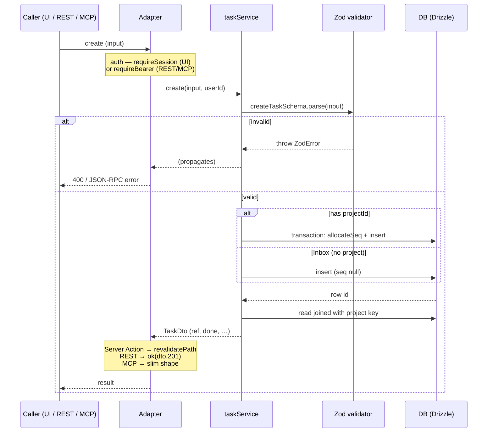
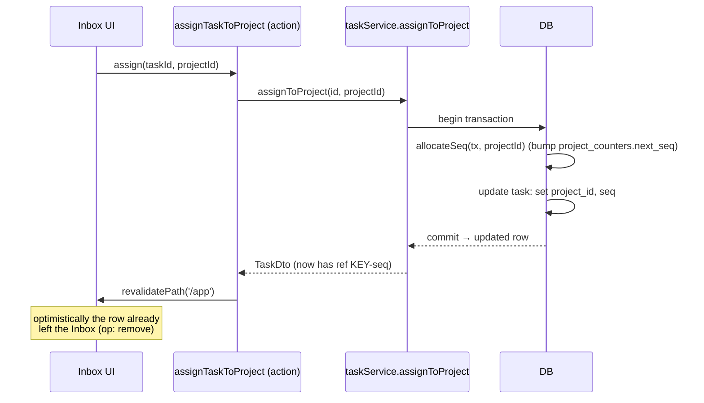
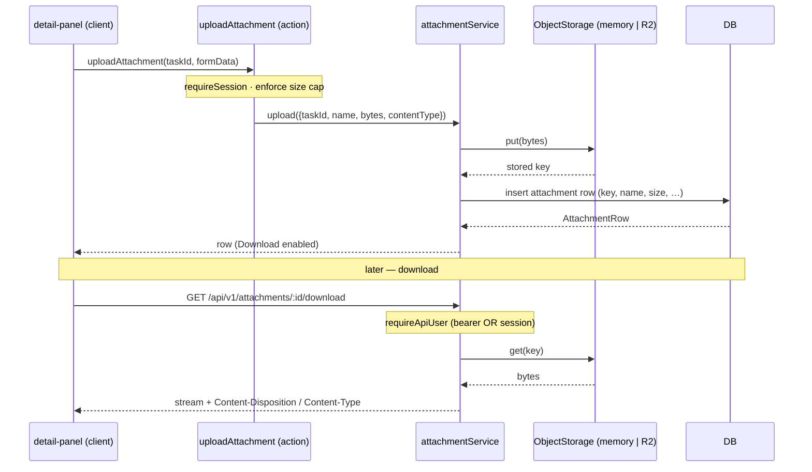
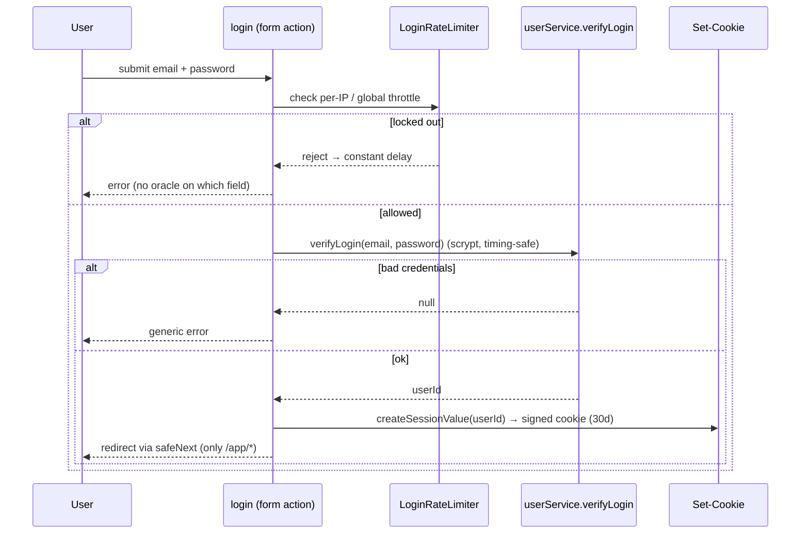

# End-to-end flows

> How a request travels through the layers. Diagrams use Mermaid (rendered on GitHub). Each
> flow ends where authority lives: the service layer + DB.

## 1. Create a task — three surfaces, one service

The defining property of the architecture: Web UI, REST, and MCP all converge on
`taskService.create`. Only the adapter differs.



Source: [_actions/tasks.ts](../../src/app/_actions/tasks.ts) ·
[api/v1/tasks/route.ts](../../src/app/api/v1/tasks/route.ts) ·
[mcp/route.ts](../../src/app/mcp/route.ts) → [task.service.ts](../../src/server/services/task.service.ts).

## 2. Inbox triage → assign to project (atomic seq)

An Inbox task has no project, no `seq`, no `ref`. Triage attaches it to a project and
allocates its sequence — atomically, so concurrent triage never collides.



Source: [task.service.ts](../../src/server/services/task.service.ts) `assignToProject` +
`allocateSeq` from [db/index.ts](../../src/server/db/index.ts). See
[data.md](data.md#atomic-per-project-sequence).

## 3. Optimistic update (board drag)

For high-frequency, single-field, near-zero-failure mutations, the client paints the change
immediately and lets the action's revalidate reconcile to server truth. Decision +
which-interactions table: [ADR 0002](../adr/0002-optimistic-updates.md).

```mermaid
sequenceDiagram
    participant U as User
    participant Cmp as board.tsx (client)
    participant R as useOptimistic reducer
    participant Act as updateTask (action)
    participant S as taskService.update
    participant DB as DB

    U->>Cmp: drop card on new column
    Cmp->>R: applyOptimistic({kind:'patch', status})
    R-->>Cmp: card repaints instantly (no snap-back)
    Cmp->>Act: await updateTask(id, {status})  (inside startTransition)
    Act->>S: update(id, patch)
    S->>DB: update + completedAt sync
    DB-->>S: row
    S-->>Act: TaskDto
    Act-->>Cmp: revalidatePath re-flows authoritative tasks
    Note over R,Cmp: optimistic value drops; server truth shows.<br/>On throw → React auto-reverts the paint
```

Shared reducer: [src/lib/optimistic.ts](../../src/lib/optimistic.ts) (`applyTaskOptimistic`).
No `router.refresh()` on these paths — `revalidatePath` already refreshes the route.

## 4. Attachment upload & download

Bytes go through the storage abstraction ([cross-cutting.md](cross-cutting.md#object-storage-attachments));
metadata goes to the DB. The two are written together and torn down together.



Source: [attachment.service.ts](../../src/server/services/attachment.service.ts) ·
`src/app/api/v1/tasks/[id]/attachments/route.ts` ·
`src/app/api/v1/attachments/[id]/download/route.ts`.

> The "wire R2 storage" work was deferred at one point (metadata-only); the storage seam is
> what made enabling real files a localized change rather than a refactor.

## 5. Login → signed session cookie



Source: [_actions/auth.ts](../../src/app/_actions/auth.ts) ·
[auth/session.ts](../../src/server/auth/session.ts) ·
[auth/rate-limit.ts](../../src/server/auth/rate-limit.ts) ·
[auth/safe-next.ts](../../src/server/auth/safe-next.ts).

---

### The pattern in all five

Auth resolves to a principal at the edge → input is validated at the service seam → business
logic + transactions run in the service → a DTO/row comes back → the adapter formats it for
its protocol. Nothing about HTTP, cookies, or JSON-RPC leaks below the adapter line; nothing
about business rules leaks above it.
